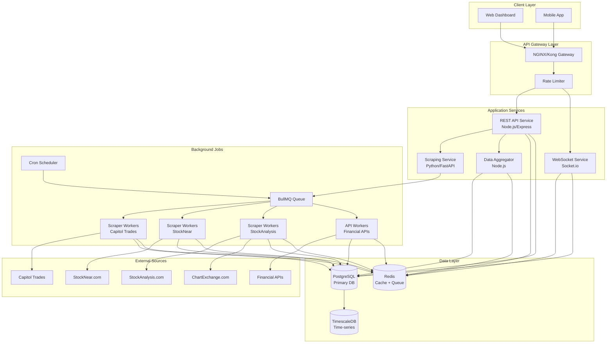

# Stock Trading Dashboard - Backend Architecture

## System Overview

A microservices-based backend system that aggregates stock trading data from multiple sources (web scraping + APIs), processes it, and serves it to frontend clients with real-time updates.

## Architecture Diagram



## Service Architecture

### 1. API Gateway (NGINX/Kong)
**Purpose**: Single entry point, load balancing, SSL termination

**Responsibilities**:
- Request routing
- Load balancing across service instances
- SSL/TLS termination
- Basic DDoS protection
- Request/response logging

**Configuration**:
```nginx
upstream api_backend {
    least_conn;
    server api-service-1:3000;
    server api-service-2:3000;
    server api-service-3:3000;
}

upstream websocket_backend {
    ip_hash;  # Sticky sessions for WebSocket
    server ws-service-1:4000;
    server ws-service-2:4000;
}

server {
    listen 443 ssl http2;
    server_name api.stockdashboard.com;

    location /api/v1/ {
        proxy_pass http://api_backend;
        proxy_set_header X-Real-IP $remote_addr;
        proxy_set_header X-Forwarded-For $proxy_add_x_forwarded_for;
    }

    location /ws {
        proxy_pass http://websocket_backend;
        proxy_http_version 1.1;
        proxy_set_header Upgrade $http_upgrade;
        proxy_set_header Connection "upgrade";
    }
}
```

### 2. REST API Service (Node.js + Express)
**Purpose**: Main application API for CRUD operations and data retrieval

**Tech Stack**:
- Node.js 20.x LTS
- Express.js 4.x
- TypeScript
- Joi/Zod for validation
- Winston for logging
- Helmet for security headers

**Key Features**:
- RESTful endpoints
- JWT authentication
- Request validation
- Error handling middleware
- API versioning
- OpenAPI/Swagger documentation

### 3. WebSocket Service (Socket.io)
**Purpose**: Real-time data streaming to clients

**Tech Stack**:
- Node.js + Socket.io
- Redis adapter for horizontal scaling
- JWT authentication for WebSocket connections

**Features**:
- Real-time price updates
- Trade notifications
- System alerts
- Room-based subscriptions (by stock ticker, politician, etc.)

### 4. Scraping Service (Python + FastAPI)
**Purpose**: Centralized web scraping with anti-bot bypass

**Tech Stack**:
- Python 3.11+
- FastAPI
- Playwright (headless browser)
- BeautifulSoup4 (HTML parsing)
- Scrapy (for simpler scraping)
- undetected-chromedriver (bot detection bypass)

**Anti-Bot Strategies**:
- Rotating user agents
- Proxy rotation
- Browser fingerprint randomization
- Request timing randomization
- Cookie management
- JavaScript rendering

### 5. Data Aggregator Service (Node.js)
**Purpose**: Process, normalize, and enrich scraped data

**Responsibilities**:
- Data validation and cleaning
- Deduplication
- Data enrichment (joining with other sources)
- Calculating derived metrics
- Triggering notifications for significant events

### 6. Background Job System (BullMQ)
**Purpose**: Asynchronous task processing and scheduling

**Job Types**:
- Periodic scraping jobs (every 5min, hourly, daily)
- API data fetching
- Data aggregation and analysis
- Report generation
- Cache warming
- Database maintenance

## Database Schema Design

### PostgreSQL Schema

```sql
-- Enable UUID extension
CREATE EXTENSION IF NOT EXISTS "uuid-ossp";

-- Politicians table
CREATE TABLE politicians (
    id UUID PRIMARY KEY DEFAULT uuid_generate_v4(),
    name VARCHAR(255) NOT NULL,
    party VARCHAR(50),
    state VARCHAR(2),
    position VARCHAR(100), -- Senator, Representative, etc.
    image_url TEXT,
    bio TEXT,
    created_at TIMESTAMP WITH TIME ZONE DEFAULT CURRENT_TIMESTAMP,
    updated_at TIMESTAMP WITH TIME ZONE DEFAULT CURRENT_TIMESTAMP,
    UNIQUE(name, state)
);

CREATE INDEX idx_politicians_name ON politicians(name);
CREATE INDEX idx_politicians_party ON politicians(party);

-- Stocks table
CREATE TABLE stocks (
    id UUID PRIMARY KEY DEFAULT uuid_generate_v4(),
    ticker VARCHAR(10) NOT NULL UNIQUE,
    company_name VARCHAR(255) NOT NULL,
    sector VARCHAR(100),
    industry VARCHAR(100),
    market_cap BIGINT,
    exchange VARCHAR(50),
    metadata JSONB, -- Additional flexible data
    created_at TIMESTAMP WITH TIME ZONE DEFAULT CURRENT_TIMESTAMP,
    updated_at TIMESTAMP WITH TIME ZONE DEFAULT CURRENT_TIMESTAMP
);

CREATE INDEX idx_stocks_ticker ON stocks(ticker);
CREATE INDEX idx_stocks_sector ON stocks(sector);
CREATE INDEX idx_stocks_metadata ON stocks USING gin(metadata);

-- Trades table (Capitol Trades data)
CREATE TABLE trades (
    id UUID PRIMARY KEY DEFAULT uuid_generate_v4(),
    politician_id UUID REFERENCES politicians(id),
    stock_id UUID REFERENCES stocks(id),
    transaction_date DATE NOT NULL,
    disclosure_date DATE,
    transaction_type VARCHAR(50) NOT NULL, -- Purchase, Sale, Exchange
    amount_min DECIMAL(15, 2),
    amount_max DECIMAL(15, 2),
    amount_range VARCHAR(50), -- "$1,001 - $15,000"
    filing_url TEXT,
    source VARCHAR(50) DEFAULT 'capitol_trades',
    raw_data JSONB, -- Store original scraped data
    created_at TIMESTAMP WITH TIME ZONE DEFAULT CURRENT_TIMESTAMP,
    updated_at TIMESTAMP WITH TIME ZONE DEFAULT CURRENT_TIMESTAMP
);

CREATE INDEX idx_trades_politician ON trades(politician_id);
CREATE INDEX idx_trades_stock ON trades(stock_id);
CREATE INDEX idx_trades_transaction_date ON trades(transaction_date DESC);
CREATE INDEX idx_trades_disclosure_date ON trades(disclosure_date DESC);
CREATE INDEX idx_trades_type ON trades(transaction_type);

-- Stock prices (TimescaleDB hypertable)
CREATE TABLE stock_prices (
    time TIMESTAMP WITH TIME ZONE NOT NULL,
    stock_id UUID REFERENCES stocks(id),
    open DECIMAL(15, 4),
    high DECIMAL(15, 4),
    low DECIMAL(15, 4),
    close DECIMAL(15, 4),
    volume BIGINT,
    source VARCHAR(50), -- stocknear, api, etc.
    PRIMARY KEY (time, stock_id)
);

-- Convert to hypertable (TimescaleDB)
SELECT create_hypertable('stock_prices', 'time');

CREATE INDEX idx_stock_prices_stock_id ON stock_prices(stock_id, time DESC);

-- Stock analytics (from StockAnalysis.com, StockNear, etc.)
CREATE TABLE stock_analytics (
    id UUID PRIMARY KEY DEFAULT uuid_generate_v4(),
    stock_id UUID REFERENCES stocks(id),
    date DATE NOT NULL,
    pe_ratio DECIMAL(10, 2),
    eps DECIMAL(10, 4),
    dividend_yield DECIMAL(5, 4),
    beta DECIMAL(5, 4),
    market_cap BIGINT,
    avg_volume BIGINT,
    week_52_high DECIMAL(15, 4),
    week_52_low DECIMAL(15, 4),
    analyst_rating VARCHAR(50), -- Buy, Hold, Sell
    price_target DECIMAL(15, 4),
    source VARCHAR(50),
    metadata JSONB, -- Additional metrics
    created_at TIMESTAMP WITH TIME ZONE DEFAULT CURRENT_TIMESTAMP,
    updated_at TIMESTAMP WITH TIME ZONE DEFAULT CURRENT_TIMESTAMP,
    UNIQUE(stock_id, date, source)
);

CREATE INDEX idx_analytics_stock_date ON stock_analytics(stock_id, date DESC);

-- Short interest data (ChartExchange.com)
CREATE TABLE short_interest (
    id UUID PRIMARY KEY DEFAULT uuid_generate_v4(),
    stock_id UUID REFERENCES stocks(id),
    date DATE NOT NULL,
    short_volume BIGINT,
    total_volume BIGINT,
    short_volume_ratio DECIMAL(5, 4), -- short_volume / total_volume
    days_to_cover DECIMAL(8, 2),
    short_interest BIGINT,
    source VARCHAR(50) DEFAULT 'chartexchange',
    created_at TIMESTAMP WITH TIME ZONE DEFAULT CURRENT_TIMESTAMP,
    UNIQUE(stock_id, date)
);

CREATE INDEX idx_short_interest_stock_date ON short_interest(stock_id, date DESC);

-- Scraping jobs tracking
CREATE TABLE scraping_jobs (
    id UUID PRIMARY KEY DEFAULT uuid_generate_v4(),
    job_type VARCHAR(100) NOT NULL, -- capitol_trades, stocknear, etc.
    status VARCHAR(50) NOT NULL, -- pending, running, completed, failed
    started_at TIMESTAMP WITH TIME ZONE,
    completed_at TIMESTAMP WITH TIME ZONE,
    records_scraped INT DEFAULT 0,
    error_message TEXT,
    metadata JSONB,
    created_at TIMESTAMP WITH TIME ZONE DEFAULT CURRENT_TIMESTAMP
);

CREATE INDEX idx_scraping_jobs_type_status ON scraping_jobs(job_type, status);
CREATE INDEX idx_scraping_jobs_created_at ON scraping_jobs(created_at DESC);

-- API usage tracking (for rate limiting)
CREATE TABLE api_usage (
    id UUID PRIMARY KEY DEFAULT uuid_generate_v4(),
    user_id UUID, -- If you have user authentication
    ip_address INET,
    endpoint VARCHAR(255),
    method VARCHAR(10),
    status_code INT,
    response_time_ms INT,
    timestamp TIMESTAMP WITH TIME ZONE DEFAULT CURRENT_TIMESTAMP
);

-- Convert to hypertable for efficient time-based queries
SELECT create_hypertable('api_usage', 'timestamp');

CREATE INDEX idx_api_usage_user ON api_usage(user_id, timestamp DESC);
CREATE INDEX idx_api_usage_ip ON api_usage(ip_address, timestamp DESC);

-- Users table (if implementing authentication)
CREATE TABLE users (
    id UUID PRIMARY KEY DEFAULT uuid_generate_v4(),
    email VARCHAR(255) UNIQUE NOT NULL,
    password_hash VARCHAR(255) NOT NULL,
    name VARCHAR(255),
    role VARCHAR(50) DEFAULT 'user', -- user, admin
    is_active BOOLEAN DEFAULT true,
    created_at TIMESTAMP WITH TIME ZONE DEFAULT CURRENT_TIMESTAMP,
    updated_at TIMESTAMP WITH TIME ZONE DEFAULT CURRENT_TIMESTAMP
);

CREATE INDEX idx_users_email ON users(email);

-- Watchlists
CREATE TABLE watchlists (
    id UUID PRIMARY KEY DEFAULT uuid_generate_v4(),
    user_id UUID REFERENCES users(id) ON DELETE CASCADE,
    name VARCHAR(255) NOT NULL,
    created_at TIMESTAMP WITH TIME ZONE DEFAULT CURRENT_TIMESTAMP,
    updated_at TIMESTAMP WITH TIME ZONE DEFAULT CURRENT_TIMESTAMP
);

CREATE TABLE watchlist_items (
    id UUID PRIMARY KEY DEFAULT uuid_generate_v4(),
    watchlist_id UUID REFERENCES watchlists(id) ON DELETE CASCADE,
    stock_id UUID REFERENCES stocks(id) ON DELETE CASCADE,
    added_at TIMESTAMP WITH TIME ZONE DEFAULT CURRENT_TIMESTAMP,
    UNIQUE(watchlist_id, stock_id)
);

-- Alerts
CREATE TABLE alerts (
    id UUID PRIMARY KEY DEFAULT uuid_generate_v4(),
    user_id UUID REFERENCES users(id) ON DELETE CASCADE,
    stock_id UUID REFERENCES stocks(id),
    politician_id UUID REFERENCES politicians(id),
    alert_type VARCHAR(50) NOT NULL, -- price_target, politician_trade, volume_spike
    condition JSONB NOT NULL, -- {"operator": ">=", "value": 100}
    is_active BOOLEAN DEFAULT true,
    triggered_at TIMESTAMP WITH TIME ZONE,
    created_at TIMESTAMP WITH TIME ZONE DEFAULT CURRENT_TIMESTAMP,
    updated_at TIMESTAMP WITH TIME ZONE DEFAULT CURRENT_TIMESTAMP
);

CREATE INDEX idx_alerts_user_active ON alerts(user_id, is_active);
```

### Redis Data Structures

```javascript
// Cache keys structure

// Stock price cache (5 minute TTL)
`stock:price:${ticker}` => JSON
// { open: 150.25, high: 152.10, low: 149.80, close: 151.50, volume: 1000000, timestamp: "2025-11-21T10:30:00Z" }

// Stock analytics cache (1 hour TTL)
`stock:analytics:${ticker}` => JSON

// Recent politician trades cache (15 minute TTL)
`trades:politician:${politicianId}` => JSON array

// Recent trades by stock (15 minute TTL)
`trades:stock:${ticker}` => JSON array

// Hot stocks cache (10 minute TTL)
`stocks:trending` => Sorted Set (score = volume or trade count)

// Rate limiting
`ratelimit:${userId}:${endpoint}` => Counter with expiry

// Active WebSocket subscriptions
`ws:subscriptions:${ticker}` => Set of connection IDs

// Job queue (BullMQ)
`bull:scraping:*` => Queue data structures

// Session storage
`session:${sessionId}` => JSON

// API response cache (varies by endpoint)
`api:cache:${endpoint}:${queryHash}` => JSON
```

## API Endpoint Specifications

### Base URL
```
Production: https://api.stockdashboard.com/v1
Development: http://localhost:3000/v1
```

### Authentication
```http
Authorization: Bearer <JWT_TOKEN>
```

### API Endpoints

#### 1. Politicians

```http
GET /v1/politicians
```
**Query Parameters**:
- `page` (default: 1)
- `limit` (default: 20, max: 100)
- `party` (filter by party: Democrat, Republican)
- `state` (filter by state code)
- `sort` (name, -name, party)

**Response**:
```json
{
  "data": [
    {
      "id": "uuid",
      "name": "Nancy Pelosi",
      "party": "Democrat",
      "state": "CA",
      "position": "Representative",
      "image_url": "https://...",
      "recent_trades_count": 15,
      "total_trade_volume": "$5,000,000 - $25,000,000"
    }
  ],
  "meta": {
    "page": 1,
    "limit": 20,
    "total": 535,
    "total_pages": 27
  }
}
```

```http
GET /v1/politicians/:id
```
**Response**:
```json
{
  "data": {
    "id": "uuid",
    "name": "Nancy Pelosi",
    "party": "Democrat",
    "state": "CA",
    "position": "Representative",
    "bio": "...",
    "image_url": "https://...",
    "stats": {
      "total_trades": 156,
      "total_stocks_traded": 45,
      "most_traded_stock": "NVDA",
      "avg_trades_per_month": 3.2
    }
  }
}
```

```http
GET /v1/politicians/:id/trades
```
**Query Parameters**:
- `page`, `limit`
- `start_date`, `end_date`
- `transaction_type` (Purchase, Sale)
- `ticker` (filter by stock)

**Response**:
```json
{
  "data": [
    {
      "id": "uuid",
      "politician": {
        "id": "uuid",
        "name": "Nancy Pelosi"
      },
      "stock": {
        "id": "uuid",
        "ticker": "NVDA",
        "company_name": "NVIDIA Corporation"
      },
      "transaction_date": "2025-11-15",
      "disclosure_date": "2025-11-18",
      "transaction_type": "Purchase",
      "amount_range": "$1,000,001 - $5,000,000",
      "amount_min": 1000001,
      "amount_max": 5000000,
      "filing_url": "https://..."
    }
  ],
  "meta": {
    "page": 1,
    "limit": 20,
    "total": 156
  }
}
```

#### 2. Stocks

```http
GET /v1/stocks
```
**Query Parameters**:
- `page`, `limit`
- `sector`, `industry`
- `search` (search by ticker or name)
- `sort` (ticker, market_cap, -market_cap)

**Response**:
```json
{
  "data": [
    {
      "id": "uuid",
      "ticker": "AAPL",
      "company_name": "Apple Inc.",
      "sector": "Technology",
      "industry": "Consumer Electronics",
      "market_cap": 3000000000000,
      "exchange": "NASDAQ",
      "current_price": 185.50,
      "change_percent": 1.25
    }
  ],
  "meta": {
    "page": 1,
    "limit": 20,
    "total": 5000
  }
}
```

```http
GET /v1/stocks/:ticker
```
**Response**:
```json
{
  "data": {
    "id": "uuid",
    "ticker": "AAPL",
    "company_name": "Apple Inc.",
    "sector": "Technology",
    "industry": "Consumer Electronics",
    "market_cap": 3000000000000,
    "exchange": "NASDAQ",
    "current_price": 185.50,
    "price_change": {
      "1d": 1.25,
      "1w": -2.30,
      "1m": 5.60,
      "ytd": 35.20
    },
    "analytics": {
      "pe_ratio": 28.5,
      "eps": 6.50,
      "dividend_yield": 0.52,
      "beta": 1.15,
      "week_52_high": 195.00,
      "week_52_low": 145.00,
      "avg_volume": 50000000,
      "analyst_rating": "Buy",
      "price_target": 200.00
    },
    "short_interest": {
      "date": "2025-11-15",
      "short_volume_ratio": 0.35,
      "days_to_cover": 2.5
    }
  }
}
```

```http
GET /v1/stocks/:ticker/prices
```
**Query Parameters**:
- `interval` (1m, 5m, 15m, 1h, 1d) - default: 1d
- `start_date`, `end_date`
- `limit` (max: 1000)

**Response**:
```json
{
  "data": [
    {
      "time": "2025-11-21T09:30:00Z",
      "open": 184.50,
      "high": 185.75,
      "low": 184.20,
      "close": 185.50,
      "volume": 5000000
    }
  ],
  "meta": {
    "ticker": "AAPL",
    "interval": "1d",
    "total": 365
  }
}
```

```http
GET /v1/stocks/:ticker/trades
```
**Description**: Get politician trades for a specific stock
**Query Parameters**: Same as politician trades

#### 3. Trades

```http
GET /v1/trades/recent
```
**Query Parameters**:
- `page`, `limit`
- `days` (default: 7, max: 90)
- `transaction_type`
- `min_amount`, `max_amount`

**Response**:
```json
{
  "data": [
    {
      "id": "uuid",
      "politician": {
        "id": "uuid",
        "name": "Nancy Pelosi",
        "party": "Democrat",
        "image_url": "https://..."
      },
      "stock": {
        "id": "uuid",
        "ticker": "NVDA",
        "company_name": "NVIDIA Corporation",
        "current_price": 450.00
      },
      "transaction_date": "2025-11-20",
      "disclosure_date": "2025-11-21",
      "transaction_type": "Purchase",
      "amount_range": "$1,000,001 - $5,000,000",
      "days_since_transaction": 1
    }
  ],
  "meta": {
    "page": 1,
    "limit": 20,
    "total": 150
  }
}
```

```http
GET /v1/trades/trending
```
**Description**: Most traded stocks by politicians in the last 30 days

**Response**:
```json
{
  "data": [
    {
      "stock": {
        "ticker": "NVDA",
        "company_name": "NVIDIA Corporation",
        "current_price": 450.00
      },
      "trade_count": 25,
      "purchase_count": 20,
      "sale_count": 5,
      "total_politicians": 15,
      "estimated_total_volume": "$50,000,000 - $100,000,000"
    }
  ]
}
```

#### 4. Analytics

```http
GET /v1/analytics/portfolio-correlation
```
**Description**: Correlation between politician trades and stock performance

**Query Parameters**:
- `politician_id`
- `days` (default: 90)

**Response**:
```json
{
  "data": {
    "politician": {
      "id": "uuid",
      "name": "Nancy Pelosi"
    },
    "period_days": 90,
    "total_trades": 45,
    "profitable_trades": 38,
    "win_rate": 0.844,
    "avg_return_7d": 0.085,
    "avg_return_30d": 0.145,
    "top_performers": [
      {
        "ticker": "NVDA",
        "purchase_date": "2025-08-15",
        "purchase_price": 380.00,
        "current_price": 450.00,
        "return": 0.184
      }
    ]
  }
}
```

```http
GET /v1/analytics/sector-analysis
```
**Description**: Sector distribution of politician trades

**Response**:
```json
{
  "data": [
    {
      "sector": "Technology",
      "trade_count": 150,
      "purchase_count": 120,
      "sale_count": 30,
      "net_buying_pressure": 0.60,
      "top_stocks": ["AAPL", "NVDA", "MSFT"]
    }
  ]
}
```

#### 5. Watchlists (Authenticated)

```http
GET /v1/watchlists
POST /v1/watchlists
GET /v1/watchlists/:id
PUT /v1/watchlists/:id
DELETE /v1/watchlists/:id
POST /v1/watchlists/:id/stocks
DELETE /v1/watchlists/:id/stocks/:stockId
```

#### 6. Alerts (Authenticated)

```http
GET /v1/alerts
POST /v1/alerts
PUT /v1/alerts/:id
DELETE /v1/alerts/:id
```

**POST /v1/alerts Request**:
```json
{
  "alert_type": "politician_trade",
  "politician_id": "uuid",
  "stock_ticker": "AAPL",
  "condition": {
    "transaction_type": "Purchase",
    "min_amount": 1000000
  }
}
```

### Error Responses

```json
{
  "error": {
    "code": "VALIDATION_ERROR",
    "message": "Invalid request parameters",
    "details": [
      {
        "field": "limit",
        "message": "Must be between 1 and 100"
      }
    ]
  }
}
```

**Error Codes**:
- `400` - Bad Request (validation errors)
- `401` - Unauthorized (missing or invalid token)
- `403` - Forbidden (insufficient permissions)
- `404` - Not Found
- `429` - Too Many Requests (rate limit exceeded)
- `500` - Internal Server Error
- `503` - Service Unavailable (scraping service down)

## Data Flow Diagrams

### 1. Scraping Flow

```
┌─────────────┐
│   Scheduler │
│   (Cron)    │
└──────┬──────┘
       │ Triggers job every 15 minutes
       ▼
┌─────────────────┐
│   BullMQ Queue  │
│   Add Job       │
└──────┬──────────┘
       │
       ▼
┌──────────────────────────────────────┐
│   Scraper Worker                     │
│   1. Fetch page (Playwright)         │
│   2. Extract data (BeautifulSoup)    │
│   3. Validate & normalize            │
└──────┬───────────────────────────────┘
       │
       ▼
┌──────────────────────────────────────┐
│   Data Validation Layer              │
│   - Schema validation                │
│   - Deduplication check              │
│   - Data enrichment                  │
└──────┬───────────────────────────────┘
       │
       ├─────────────────┬──────────────┐
       ▼                 ▼              ▼
┌─────────────┐   ┌───────────┐  ┌──────────┐
│ PostgreSQL  │   │   Redis   │  │ WebSocket│
│ (persist)   │   │  (cache)  │  │(broadcast)│
└─────────────┘   └───────────┘  └──────────┘
```

### 2. API Request Flow

```
┌──────────┐
│  Client  │
└────┬─────┘
     │ GET /v1/stocks/AAPL
     ▼
┌─────────────┐
│   NGINX     │
└────┬────────┘
     │
     ▼
┌─────────────────┐
│  Rate Limiter   │
│  Check quota    │
└────┬────────────┘
     │
     ▼
┌─────────────────────────┐
│   API Service           │
│   1. Auth validation    │
│   2. Request validation │
└────┬────────────────────┘
     │
     ▼
┌─────────────────────────┐
│   Check Redis Cache     │
└────┬────────────────────┘
     │
     ├─── Cache HIT ────────┐
     │                      │
     │                      ▼
     │              ┌───────────────┐
     │              │ Return cached │
     │              │     data      │
     │              └───────────────┘
     │
     └─── Cache MISS ──────┐
                           ▼
                  ┌────────────────┐
                  │  PostgreSQL    │
                  │  Query data    │
                  └────┬───────────┘
                       │
                       ▼
                  ┌────────────────┐
                  │  Cache result  │
                  │  in Redis      │
                  └────┬───────────┘
                       │
                       ▼
                  ┌────────────────┐
                  │ Return to      │
                  │    client      │
                  └────────────────┘
```

### 3. Real-time Update Flow

```
┌──────────────┐
│ Scraper Job  │
│  (New Trade) │
└──────┬───────┘
       │
       ▼
┌──────────────────┐
│  PostgreSQL      │
│  INSERT trade    │
└──────┬───────────┘
       │
       ▼
┌──────────────────────────┐
│  Post-Insert Trigger     │
│  NOTIFY 'new_trade'      │
└──────┬───────────────────┘
       │
       ▼
┌──────────────────────────┐
│  WebSocket Service       │
│  Listen to PG NOTIFY     │
└──────┬───────────────────┘
       │
       ├──────────────────────────┐
       │                          │
       ▼                          ▼
┌─────────────────┐      ┌─────────────────┐
│  Redis Pub/Sub  │      │  Alert Service  │
│  Broadcast      │      │  Check triggers │
└────┬────────────┘      └────┬────────────┘
     │                        │
     ▼                        ▼
┌─────────────────┐      ┌─────────────────┐
│  WebSocket      │      │  Send Email/    │
│  Emit to        │      │  Push Notif     │
│  subscribed     │      └─────────────────┘
│  clients        │
└─────────────────┘
```

